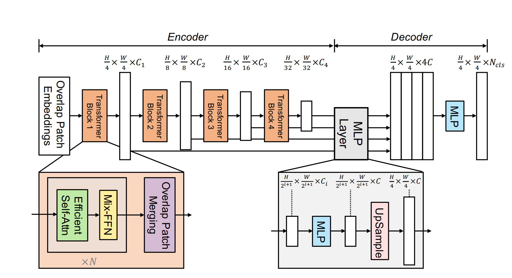
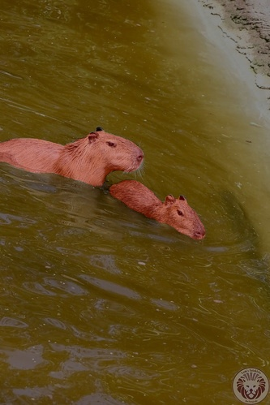
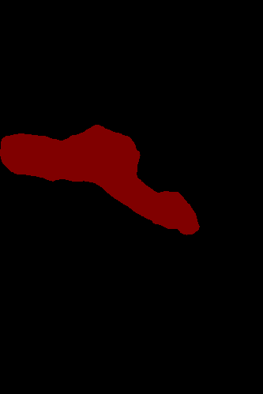
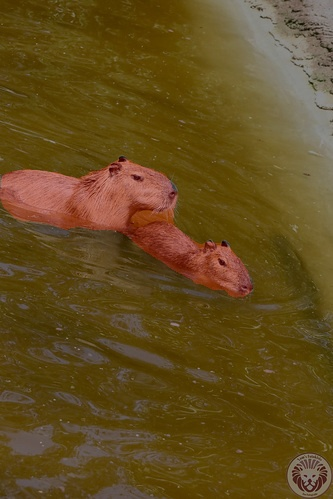
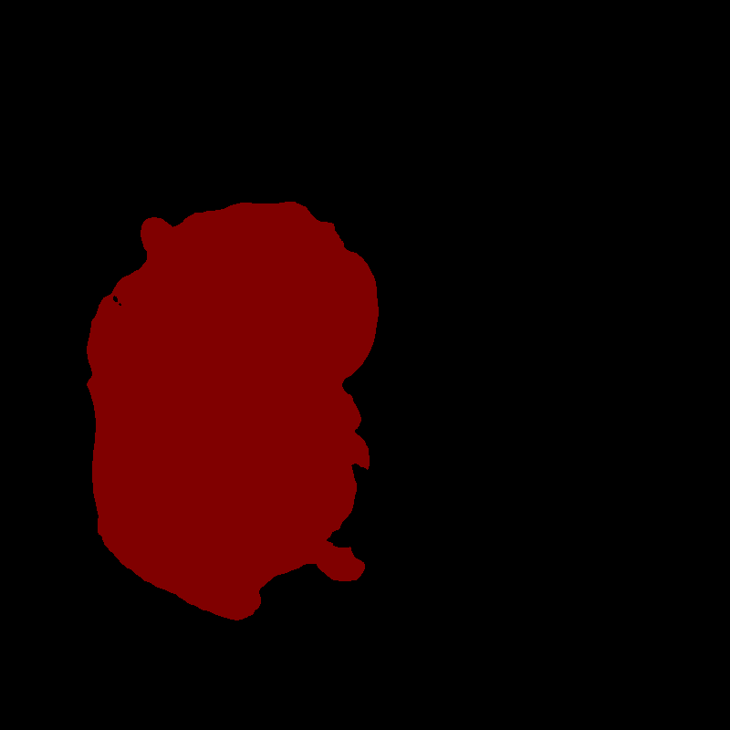
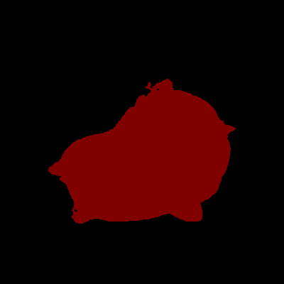
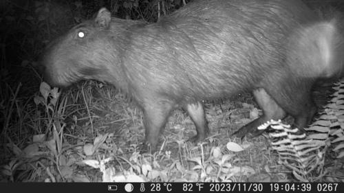
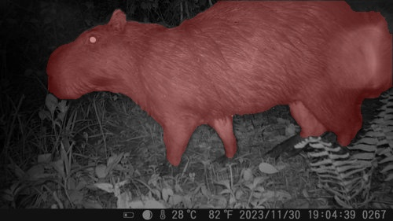
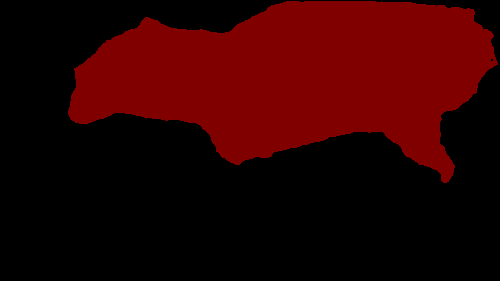
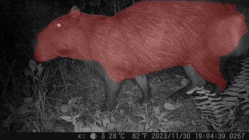

# SegFormer Capybara Segmentation

A compact SegFormer-B0 semantic segmentation pipeline for capybara segmentation. The code keeps the project small while supporting training, validation, mIoU evaluation, and single-image prediction with overlay visualization.

This project is simplified from the open-source `bubbliiiing/segformer-pytorch` implementation and adapted for a two-class capybara segmentation task.

## Features

- VOC-style dataset loading
- Lightweight SegFormer-B0 model
- Training and validation loop
- Cosine, step, and fixed learning-rate schedules
- mIoU, mPA, precision, recall, Dice, and accuracy evaluation
- Single-image prediction with mask and overlay outputs
- Optional distributed training with PyTorch DDP

## Model Architecture



## Project Structure

```text
.
├── config.yaml
├── evaluate.py
├── predict.py
├── requirements.txt
├── src/
│   ├── __init__.py
│   ├── dataloader.py
│   ├── loss.py
│   ├── lr_scheduler.py
│   ├── model.py
│   └── trainer.py
├── train.py
└── README.md
```

Dataset files, checkpoints, and prediction outputs are intentionally ignored by Git.

## Installation

```bash
pip install -r requirements.txt
```

Install the PyTorch build that matches your CUDA version if you plan to train on GPU.

## Dataset

Prepare the dataset in VOC format:

```text
VOCdevkit/VOC2007/
├── JPEGImages/
├── SegmentationClass/
└── ImageSets/Segmentation/
    ├── train.txt
    └── val.txt
```

Each line in `train.txt` and `val.txt` should contain the image id without extension. For example, `capybara_0001` maps to:

```text
VOCdevkit/VOC2007/JPEGImages/capybara_0001.jpg
VOCdevkit/VOC2007/SegmentationClass/capybara_0001.png
```

If your masks use pixel value `255` for the foreground class, keep `dataset.mask_255_to_1: true` in `config.yaml`. If masks already use class ids `0` and `1`, set it to `false`.

## Training

Edit `config.yaml` as needed, then run:

```bash
python train.py
```

By default, checkpoints are written to:

```text
outputs/checkpoints/
```

For distributed training, set `train.distributed: true` and run with `torchrun`, for example:

```bash
torchrun --nproc_per_node=2 train.py
```

## Evaluation

Generate predictions and compute metrics using the checkpoint configured in `config.yaml`:

```bash
python evaluate.py
```

Or pass a checkpoint path explicitly:

```bash
python evaluate.py outputs/checkpoints/best_epoch_weights.pth
```

## Prediction

Run prediction for one image:

```bash
python predict.py path/to/image.jpg
```

The raw mask and overlay image are written to `outputs/predict/` by default.

## Checkpoints

Model checkpoints are not committed to this repository. Put local weights under `outputs/checkpoints/` or update `config.yaml` to point to your checkpoint path.

## Qualitative Results

| Scene | Input Image | Ground Truth Overlay | Prediction | Prediction Overlay |
|---|---|---|---|---|
| Natural scene |  |  |  |  |
| Doll |  |  |  |  |
| Cartoon |  |  |  |  |
| Night scene |  |  |  |  |

## Citation

```bibtex
@inproceedings{xie2021segformer,
  title={SegFormer: Simple and Efficient Design for Semantic Segmentation with Transformers},
  author={Xie, Enze and Wang, Wenhai and Yu, Zhiding and Anandkumar, Anima and Alvarez, Jose M and Luo, Ping},
  booktitle={Neural Information Processing Systems (NeurIPS)},
  year={2021}
}
```
